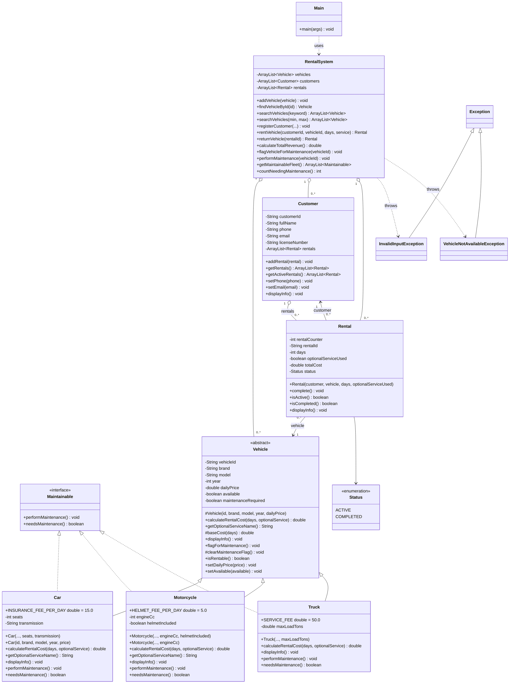

# UML Class Diagram

Image version: `docs/UML_Class_Diagram.png`

```mermaid
classDiagram
direction TB

class Maintainable {
    <<interface>>
    +performMaintenance() void
    +needsMaintenance() boolean
}

class Vehicle {
    <<abstract>>
    -String vehicleId
    -String brand
    -String model
    -int year
    -double dailyPrice
    -boolean available
    -boolean maintenanceRequired
    #Vehicle(id, brand, model, year, dailyPrice)
    +calculateRentalCost(days, optionalService) double
    +getOptionalServiceName() String
    #baseCost(days) double
    +displayInfo() void
    +flagForMaintenance() void
    #clearMaintenanceFlag() void
    +isRentable() boolean
    +setDailyPrice(price) void
    +setAvailable(available) void
}

class Car {
    +INSURANCE_FEE_PER_DAY double = 15.0
    -int seats
    -String transmission
    +Car(..., seats, transmission)
    +Car(id, brand, model, year, price)
    +calculateRentalCost(days, optionalService) double
    +getOptionalServiceName() String
    +displayInfo() void
    +performMaintenance() void
    +needsMaintenance() boolean
}

class Motorcycle {
    +HELMET_FEE_PER_DAY double = 5.0
    -int engineCc
    -boolean helmetIncluded
    +Motorcycle(..., engineCc, helmetIncluded)
    +Motorcycle(..., engineCc)
    +calculateRentalCost(days, optionalService) double
    +getOptionalServiceName() String
    +displayInfo() void
    +performMaintenance() void
    +needsMaintenance() boolean
}

class Truck {
    +SERVICE_FEE double = 50.0
    -double maxLoadTons
    +Truck(..., maxLoadTons)
    +calculateRentalCost(days, optionalService) double
    +displayInfo() void
    +performMaintenance() void
    +needsMaintenance() boolean
}

class Customer {
    -String customerId
    -String fullName
    -String phone
    -String email
    -String licenseNumber
    -ArrayList~Rental~ rentals
    +addRental(rental) void
    +getRentals() ArrayList~Rental~
    +getActiveRentals() ArrayList~Rental~
    +setPhone(phone) void
    +setEmail(email) void
    +displayInfo() void
}

class Rental {
    -int rentalCounter
    -String rentalId
    -int days
    -boolean optionalServiceUsed
    -double totalCost
    -Status status
    +Rental(customer, vehicle, days, optionalServiceUsed)
    +complete() void
    +isActive() boolean
    +isCompleted() boolean
    +displayInfo() void
}

class Status {
    <<enumeration>>
    ACTIVE
    COMPLETED
}

class RentalSystem {
    -ArrayList~Vehicle~ vehicles
    -ArrayList~Customer~ customers
    -ArrayList~Rental~ rentals
    +addVehicle(vehicle) void
    +findVehicleById(id) Vehicle
    +searchVehicles(keyword) ArrayList~Vehicle~
    +searchVehicles(min, max) ArrayList~Vehicle~
    +registerCustomer(...) void
    +rentVehicle(customerId, vehicleId, days, service) Rental
    +returnVehicle(rentalId) Rental
    +calculateTotalRevenue() double
    +flagVehicleForMaintenance(vehicleId) void
    +performMaintenance(vehicleId) void
    +getMaintainableFleet() ArrayList~Maintainable~
    +countNeedingMaintenance() int
}

class Main {
    +main(args) void
}

class InvalidInputException
class VehicleNotAvailableException

Vehicle <|-- Car
Vehicle <|-- Motorcycle
Vehicle <|-- Truck
Maintainable <|.. Car
Maintainable <|.. Motorcycle
Maintainable <|.. Truck
Exception <|-- InvalidInputException
Exception <|-- VehicleNotAvailableException

Rental "0..*" --> "1" Customer : customer
Rental "0..*" --> "1" Vehicle : vehicle
Customer "1" o-- "0..*" Rental : rentals
Rental --> Status
RentalSystem "1" o-- "0..*" Vehicle
RentalSystem "1" o-- "0..*" Customer
RentalSystem "1" o-- "0..*" Rental
Main ..> RentalSystem : uses
RentalSystem ..> InvalidInputException : throws
RentalSystem ..> VehicleNotAvailableException : throws
```
